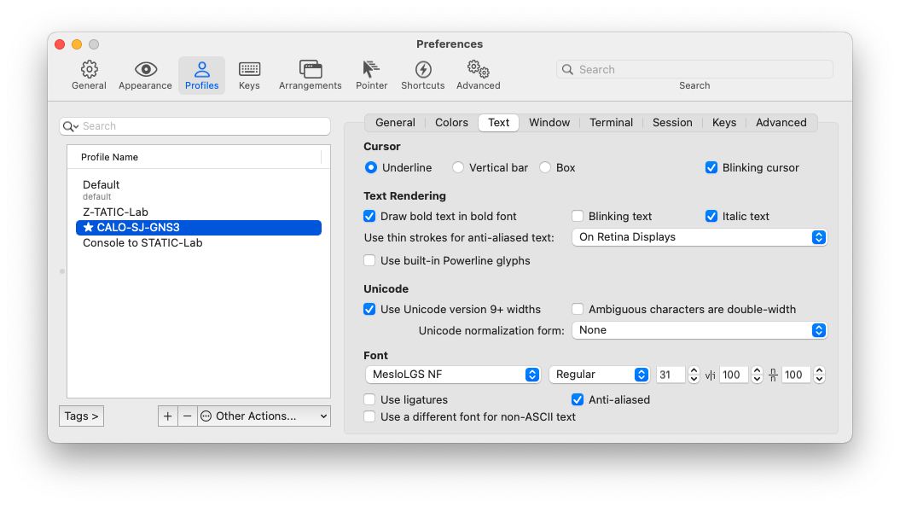

# Powerlevel 10k customization for Zsh

Customized settings I gleaned from other people's posts.

## Setup Powerlevel 10k
   *  P10k is a fantastic Zshell theme from romkatv! Just follow instructions here:  [Get Started](https://github.com/romkatv/powerlevel10k#get-started)

### Ensure font is set in terminal

In iTerm2 > Preferences > Profile > Text
 make sure that the font MesloLGS NF is selected
 

## Fix the Virtual Environment prompt

### Problem:

   *  When you activate a new virtual environment, the prompt does NOT show it

```bash
python3.9 -m venv venv
source venv/bin/activate
╭─   ~/Documents/Development/DevCore/Server   master:main ?5                    14.15.3  23:44:12
╰─❯ deactivate
```

 ### Solution:

   *  Refer to [romkatv](https://github.com/romkatv/powerlevel10k/issues/532#issuecomment-592064973)'s posted solution:

      1. Open ~/.p10k.zsh.
      2. Add this line to it, preferably close to the existing POWERLEVEL9K_VIRTUALENV_SHOW_PYTHON_VERSION parameter:

```bash
typeset -g POWERLEVEL9K_VIRTUALENV_GENERIC_NAMES=(virtualenv venv .venv env)
```

   *  While you are there, you can also tweak the following to show the Python version and add a virtual environment icon

```bash
typeset -g POWERLEVEL9K_VIRTUALENV_SHOW_PYTHON_VERSION=true
typeset -g POWERLEVEL9K_VIRTUALENV_VISUAL_IDENTIFIER_EXPANSION='⭐'
```

      3. restart zsh (don't just source ~/.zshrc, actually restart the shell)

 #### Verification:

```
source venv/bin/activate
╭─   ~/Documents/Development/DevCore/Server   master:main ?5    ⭐ 3.9.1 Server  14.15.3  23:45:37
╰─❯
```
   *  You can check the settings with
```
() {
emulate -L zsh
typeset -pm 'POWERLEVEL9K_*|ZSH_VERSION|VIRTUAL_ENV'
} | grep -i virtual
typeset -g POWERLEVEL9K_VIRTUALENV_FOREGROUND=37
typeset -g -a POWERLEVEL9K_RIGHT_PROMPT_ELEMENTS=( status command_execution_time background_jobs direnv asdf virtualenv anaconda pyenv goenv nodenv nvm nodeenv rbenv rvm fvm luaenv jenv plenv phpenv scalaenv haskell_stack kubecontext terraform aws aws_eb_env azure gcloud google_app_cred context nordvpn ranger nnn vim_shell midnight_commander nix_shell todo timewarrior taskwarrior time newline )
typeset -g -a POWERLEVEL9K_VIRTUALENV_GENERIC_NAMES=( virtualenv venv .venv env )
typeset -g POWERLEVEL9K_VIRTUALENV_RIGHT_DELIMITER=''
typeset -g POWERLEVEL9K_VIRTUALENV_LEFT_DELIMITER=''
typeset -g POWERLEVEL9K_VIRTUALENV_SHOW_WITH_PYENV=false
typeset -g POWERLEVEL9K_VIRTUALENV_VISUAL_IDENTIFIER_EXPANSION=⭐
typeset -g POWERLEVEL9K_VIRTUALENV_SHOW_PYTHON_VERSION=true
```
# zsh-nvm plugin

Customized ~/.zshrc, so it automatically installs the .zsh-nvm plugin

See  [ lukechilds /
zsh-nvm](https://github.com/lukechilds/zsh-nvm#manually)


```
# zsh-nvm plugin - https://github.com/lukechilds/zsh-nvm
if [[ ! -d "${HOME}/.oh-my-zsh/custom/plugins/zsh-nvm" ]]; then
    git clone https://github.com/lukechilds/zsh-nvm.git ${HOME}/.oh-my-zsh/custom/plugins/zsh-nvm
fi
# ssh-agent plugin - see https://github.com/ohmyzsh/ohmyzsh/tree/master/plugins/ssh-agent
plugins=(ansible git colored-man-pages colorize pip python brew ssh-agent vagrant virtualenv zsh-nvm)
```

## nvm alias error: 'nvm_list_aliases:36: no matches found: ~/.nvm/alias/lts/*'

To avoid this error, we install the latest --lts version

```
# install the latest LTS version for nvm
# to avoid error 'nvm_list_aliases:36: no matches found: ~/.nvm/alias/lts/*'
nvm install --lts && nvm use --lts
```