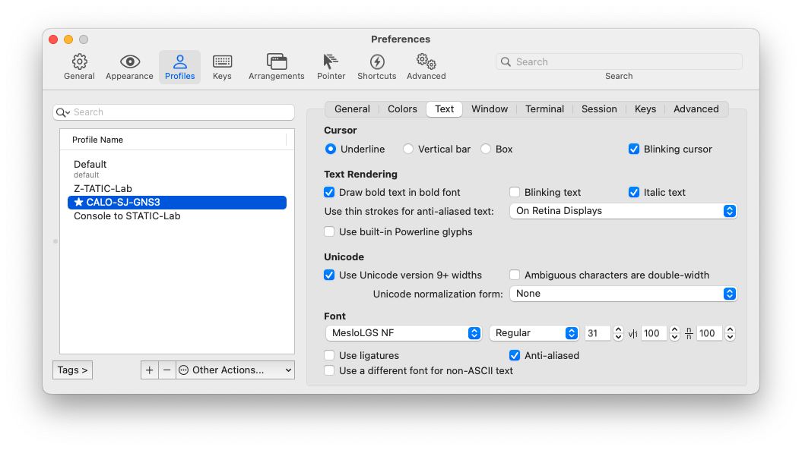
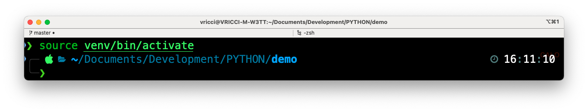
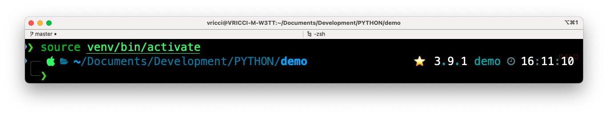
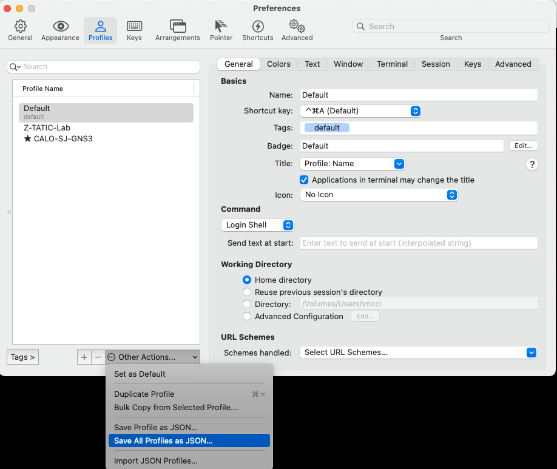
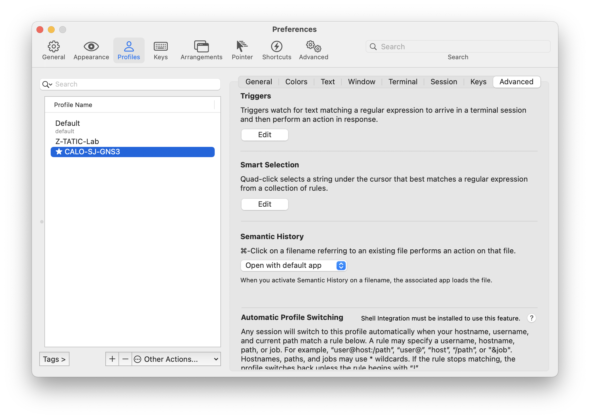
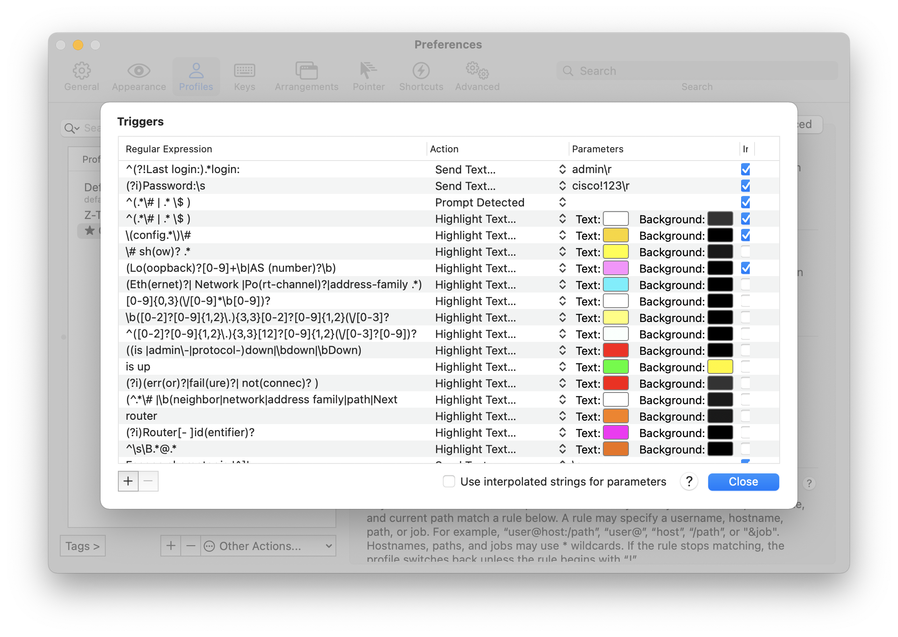
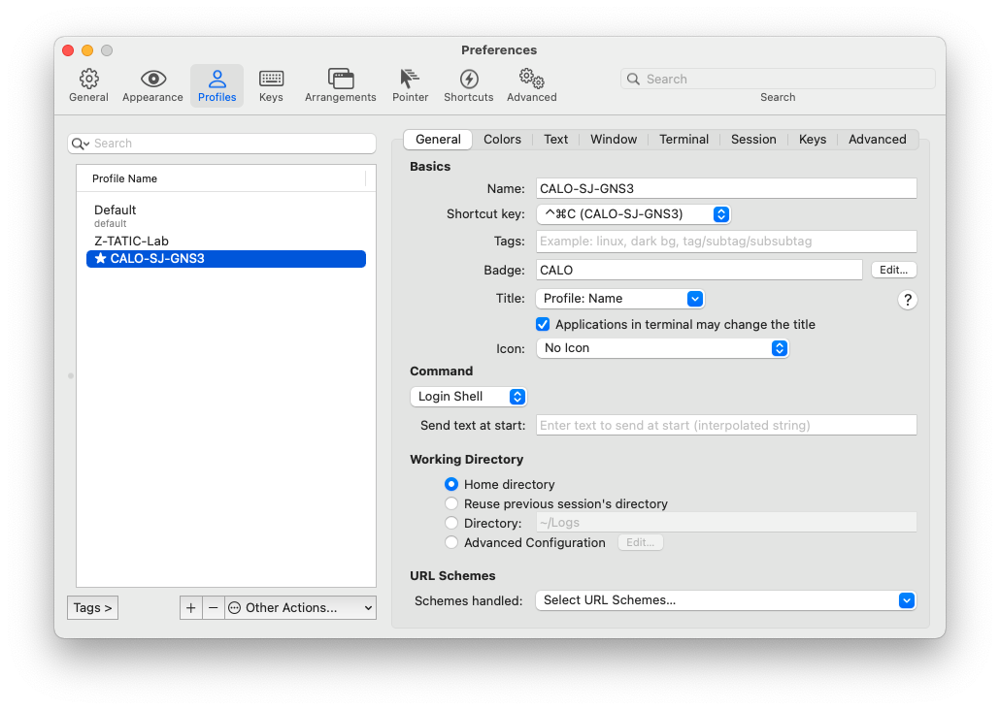
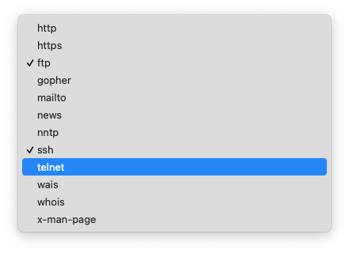
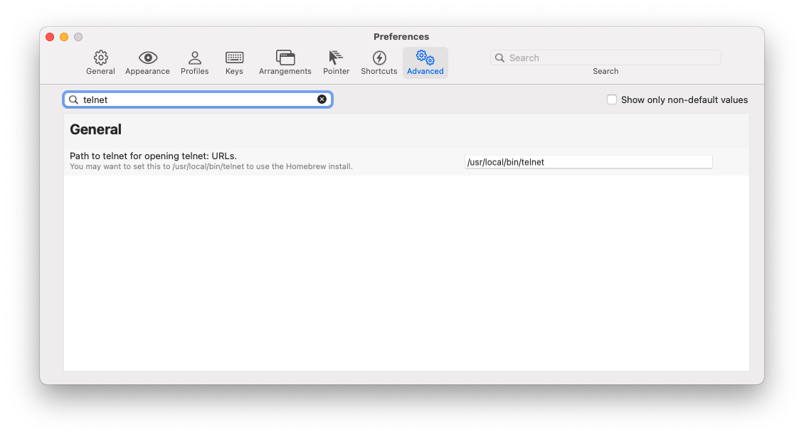

# Customization Tips

## Powerlevel 10k

P10k is a fantastic Zshell theme from romkatv! - Follow [Get Started](https://github.com/romkatv/powerlevel10k#get-started)

### Set the Terminal Font

+ Open ```iTerm2 Preferences```. Select ```Profile > Text```
+ Below ```Font``` select ```MesloLGS NF```


### Fix the Virtual Environment Prompt

#### The Problem

+ The prompt DOES NOT change after activating a new virtual environment

   ```zsh
   python3.9 -m venv venv
   source venv/bin/activate
   ```



#### [Solution from romkatv](https://github.com/romkatv/powerlevel10k/issues/532#issuecomment-592064973)

1. Open ~/.p10k.zsh.
2. Add the following line close to the existing parameter ```POWERLEVEL9K_VIRTUALENV_SHOW_PYTHON_VERSION```

   ```zsh
   typeset -g POWERLEVEL9K_VIRTUALENV_GENERIC_NAMES=(virtualenv venv .venv env)
   ```

3. While you are there, you can also tweak the following to force the prompt to show the Python version and add a star icon to emphasize that the virtual environment is active

   ```zsh
   typeset -g POWERLEVEL9K_VIRTUALENV_SHOW_PYTHON_VERSION=true
   typeset -g POWERLEVEL9K_VIRTUALENV_VISUAL_IDENTIFIER_EXPANSION='⭐'
   ```

4. **Restart the shell** - don't just ```source ~/.zshrc```

5. Verify that after activating the virtual environment... the prompt DOES CHANGE
(added star icon, python version and the name of the environment)

   

6. You can confirm the p10k settings with this function (paste this at the prompt)

   ```zsh
   () {
   emulate -L zsh
   typeset -pm 'POWERLEVEL9K_*|ZSH_VERSION|VIRTUAL_ENV'
   } | grep -i virtual
   ```

+ Output

   ```zsh
   typeset -g POWERLEVEL9K_VIRTUALENV_FOREGROUND=37
   typeset -g -a POWERLEVEL9K_RIGHT_PROMPT_ELEMENTS=( status command_execution_time background_jobs direnv asdf virtualenv anaconda pyenv goenv nodenv nvm nodeenv rbenv rvm fvm luaenv jenv plenv phpenv scalaenv haskell_stack kubecontext terraform aws aws_eb_env azure gcloud google_app_cred context nordvpn ranger nnn vim_shell midnight_commander nix_shell todo timewarrior taskwarrior time newline )
   typeset -g -a POWERLEVEL9K_VIRTUALENV_GENERIC_NAMES=( virtualenv venv .venv env )
   typeset -g POWERLEVEL9K_VIRTUALENV_RIGHT_DELIMITER=''
   typeset -g POWERLEVEL9K_VIRTUALENV_LEFT_DELIMITER=''
   typeset -g POWERLEVEL9K_VIRTUALENV_SHOW_WITH_PYENV=false
   typeset -g POWERLEVEL9K_VIRTUALENV_VISUAL_IDENTIFIER_EXPANSION=⭐
   typeset -g POWERLEVEL9K_VIRTUALENV_SHOW_PYTHON_VERSION=true
   ```

## zsh-nvm plugin

Customized ```~/.zshrc``` to automatically install ```.zsh-nvm plugin``` - See [lukechilds /
zsh-nvm](https://github.com/lukechilds/zsh-nvm#manually)

```zsh
# zsh-nvm plugin - https://github.com/lukechilds/zsh-nvm
if [[ ! -d "${HOME}/.oh-my-zsh/custom/plugins/zsh-nvm" ]]; then
    git clone https://github.com/lukechilds/zsh-nvm.git ${HOME}/.oh-my-zsh/custom/plugins/zsh-nvm
fi
# ssh-agent plugin - see https://github.com/ohmyzsh/ohmyzsh/tree/master/plugins/ssh-agent
plugins=(ansible git colored-man-pages colorize pip python brew ssh-agent vagrant virtualenv zsh-nvm)
```

### nvm alias error: ```nvm_list_aliases:36: no matches found: ~/.nvm/alias/lts/*```

+ To avoid this error, we install the latest ```--lts``` version

   ```zsh
   # install the latest LTS version for nvm to avoid error 'nvm_list_aliases:36: no matches found: ~/.nvm/alias/lts/*'
   nvm install --lts && nvm use --lts
   ```

## iTerm2

This continues to be an **awesome** Terminal replacement for macOS ([download](https://iterm2.com/index.html))

### PROFILE MANAGEMENT

+ If you use different machines, you can port your profiles easily and save them as a JSON file

   1. Go to ```Preferences```
   2. Select a Profile (create one)
   3. Select the Profile Advanced tab
   4. Click ```Other Actions``` to import/export/duplicate your profiles

   

### COLORIZED LOG VIEWER AND MORE WITH 'TRIGGERS'

"Triggers watch for text matching a regular expression to arrive in a terminal session and then perform an action in response".
+ Login prompt detection + pass a username automatically
+ Colorize fields e.g. IP addresses, failures, errors, etc

Here is a screenshot of an output that has been automatically colorized
+ 

Here are the steps needed to configure the Triggers

1. Open ```Preferences > Profile > Advanced```
click the ```Edit``` button under ```Triggers```

2. We can define regex to match specific patterns and action to change colors



### DEFAULT TERMINAL FOR TELNET AND OTHER PROTOCOLS

#### Install Homebrew

+ [Homebrew](https://brew.sh/) documentation
+ Open ```Terminal.app``` or ```iTerm.app```
+ At the prompt paste:

   ```zsh
      sudo xcode-select --install
      /bin/bash -c "$(curl -fsSL https://raw.githubusercontent.com/Homebrew/install/HEAD/install.sh)"
   ```

#### Install```Telnet```

1. Use homebrew to install telnet
   + available as a standalone ```telnet``` formula
   + or bundled with other networking utilities from ```inetutils```  <<<  We choose this approach below

   ```zsh
      brew install inetutils
   ```


2. ```inetutils``` includes several utilities

   ```zsh
   ❯ brew info inetutils
   < snip >
   The following commands have been installed with the prefix 'g'.

      dnsdomainname
      ftp
      rcp
      rexec
      rlogin
      rsh
      telnet    <<<<<<
   ```

#### URL Schemes

+ This setting ensures that iTerm is the default Terminal application when clicking URLs for a specified protocol

1. Select your iTerm profile  (General Tab)

2. Click the combo box 'Select URL Schemes'


3. Click a protocol. You will be prompted whether to accept iTerm2 as the default Terminal application. Click OK


+ For protocol utilities with a path other than the normal system path /usr/bin,  e.g. homebrew installed ```telnet``` and ```ftp```, we also need to specify the path in iTerm2.

4. Find the PATH of ```telnet```

   ```zsh
   ❯ which -a telnet
   /usr/local/bin/telnet
   ```

5. Open iTerm2 ```Preferences > Advanced``` Tab (**not** ```Profile > Advanced```):
In the Search bar, type ```telnet``` + ENTER.
Update the path to ```/usr/local/bin/telnet```


6. Repeat for ftp as needed.  Done.